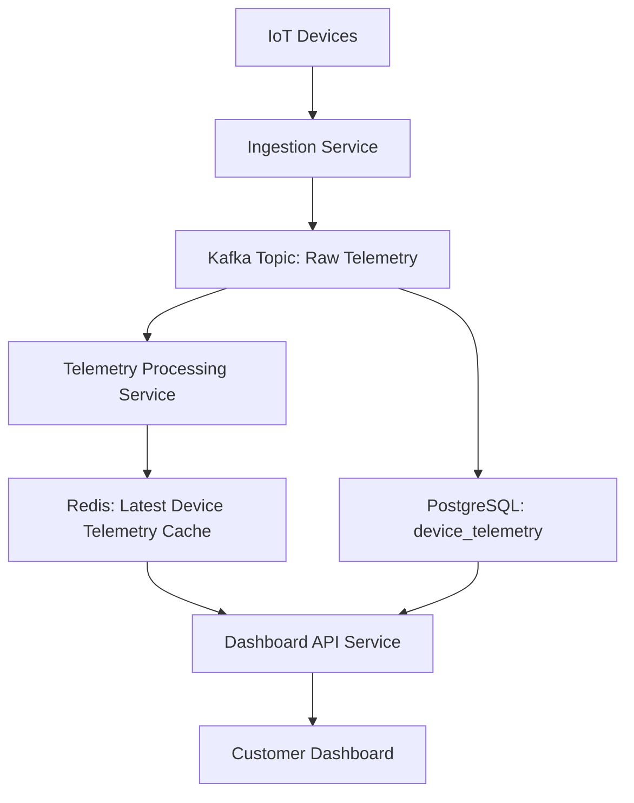

# 2026-08-20 — System design

*Thursday. Question and worked answer, both generated.*

---

## Scenario

Your company provides a multi-tenant SaaS platform where customers can manage their IoT devices. Each device periodically sends telemetry data (e.g., temperature, humidity, battery level) to your backend. This data is stored in a `device_telemetry` table in PostgreSQL. The table has grown significantly: it now contains hundreds of millions of rows, with roughly 100,000 new records being inserted per second during peak times. A simplified schema looks like this:

```sql
CREATE TABLE device_telemetry (
    id UUID PRIMARY KEY DEFAULT gen_random_uuid(),
    device_id UUID NOT NULL,
    customer_id UUID NOT NULL,
    timestamp TIMESTAMPTZ NOT NULL,
    temperature NUMERIC,
    humidity NUMERIC,
    battery_level NUMERIC,
    -- ... many other telemetry fields
    metadata JSONB
);
```

Customers use a dashboard to visualize their device data. A common query is to retrieve the latest telemetry record for *each* of their active devices. This query is executed frequently (every 10-15 seconds) for each active customer and has recently started timing out or taking over 10 seconds to complete, severely impacting dashboard usability.

The current problematic query looks something like this (simplified):

```sql
SELECT dt.*
FROM device_telemetry dt
WHERE dt.customer_id = 'a-customer-id'
AND dt.device_id IN ('device-1-id', 'device-2-id', ..., 'device-N-id') -- N can be 100s
QUALIFY ROW_NUMBER() OVER (PARTITION BY dt.device_id ORDER BY dt.timestamp DESC) = 1;
```
(Note: `QUALIFY` is a SQL standard, but for PostgreSQL, this is typically achieved with a CTE or subquery).

## Requirements

The primary requirement is to significantly reduce the latency of retrieving the latest telemetry data for a set of devices belonging to a single customer, targeting an average response time of under 500ms. The solution must handle the high ingestion rate without impacting other critical operations. The system needs to scale to support thousands of active customers simultaneously querying their data. Data consistency for the "latest record" is paramount; users must always see the absolute latest data available for a device.

## Deliverables

1.  A high-level diagram (boxes and arrows) illustrating the proposed architecture changes and data flow.
2.  A description of any new data stores or services introduced, including their purpose and key characteristics.
3.  Any changes to the existing `device_telemetry` table schema (e.g., new indexes, partitions) or suggestions for new tables.
4.  An outline of how the problematic query would be re-written or replaced to achieve the performance target.

## Going further

Explain the trade-offs of your proposed solution regarding operational complexity, data consistency models (e.g., strong vs. eventual), and potential cost implications, especially as the number of active devices and customers continues to grow.

---

## Worked answer

### 1. High-level architecture diagram



**Explanation of Data Flow:**

1.  **IoT Devices** send telemetry data to the **Ingestion Service**.
2.  The **Ingestion Service** performs initial validation and then publishes the raw telemetry data to a **Kafka Topic: Raw Telemetry**. This acts as a buffer and enables decoupling.
3.  A consumer (or set of consumers) from the **Ingestion Service** or a dedicated **PostgreSQL Writer Service** reads from the Kafka topic and writes the data to the **PostgreSQL: `device_telemetry`** table for historical storage.
4.  Concurrently, the **Telemetry Processing Service** also consumes from the **Kafka Topic: Raw Telemetry**.
5.  The **Telemetry Processing Service** processes incoming telemetry, identifies the latest record for each `device_id`, and updates the **Redis: Latest Device Telemetry Cache**.
6.  The **Customer Dashboard** makes requests to the **Dashboard API Service** to retrieve data.
7.  The **Dashboard API Service** primarily queries the **Redis: Latest Device Telemetry Cache** for the latest device telemetry.
8.  In cases where data is not in Redis (e.g., cache miss, initial load), the **Dashboard API Service** can fall back to querying **PostgreSQL**.

### 2. New data stores or services introduced

1.  **Kafka Topic: Raw Telemetry**
    *   **Purpose:** Acts as a high-throughput, fault-tolerant message bus. It decouples the ingestion path from the storage and processing paths, allowing different services to consume the same data stream independently and at their own pace. It buffers spikes in ingestion and provides durability for data before it's persisted to long-term storage or processed.
    *   **Key Characteristics:** Distributed, append-only log, high-throughput, low-latency, durable, supports multiple consumers.
2.  **Telemetry Processing Service**
    *   **Purpose:** A dedicated microservice responsible for consuming raw telemetry from Kafka, identifying the absolute latest record for each device, and updating a fast-access cache. This offloads the "latest record" computation from the PostgreSQL database and prepares the data for quick retrieval.
    *   **Key Characteristics:** Scalable (can run multiple instances), stateless (or state managed externally, e.g., consumer offsets in Kafka), consumes from Kafka, writes to Redis.
3.  **Redis: Latest Device Telemetry Cache**
    *   **Purpose:** A high-performance in-memory data store used to store the *absolute latest* telemetry record for each device. This cache is optimized for very fast key-value lookups, making it ideal for the dashboard's frequent "get latest for N devices" queries.
    *   **Key Characteristics:** In-memory, extremely low-latency reads/writes, supports various data structures (e.g., Hash, Sorted Set), high availability (e.g., Redis Cluster, Sentinel), configurable persistence (RDB/AOF) for durability.
4.  **Dashboard API Service** (Refinement of existing API)
    *   **Purpose:** While an API likely exists, its implementation will change to prioritize querying Redis for latest telemetry. It acts as the primary interface for the customer dashboard.
    *   **Key Characteristics:** Exposes endpoints for dashboard queries, integrates with Redis and potentially PostgreSQL for fallback/historical data.

### 3. Changes to existing `device_telemetry` table schema and new tables

#### Existing `device_telemetry` table changes:

The current primary key `id UUID PRIMARY KEY DEFAULT gen_random_uuid()` is not optimal for the problematic query. While it's good for uniqueness, it doesn't help with ordering or filtering by `device_id` and `timestamp`.

1.  **New Index:**
    To improve the performance of queries that filter by `customer_id` and `device_id` and order by `timestamp`, a composite index is crucial.

    ```sql
    CREATE INDEX idx_device_telemetry_customer_device_ts ON device_telemetry (customer_id, device_id, timestamp DESC);
    ```
    *   **Why:** This index allows PostgreSQL to efficiently locate all records for a given `customer_id` and `device_id`, and then quickly find the latest `timestamp` without scanning the entire table or even large portions of it. The `DESC` order on `timestamp` is critical for queries looking for the "latest".

2.  **Partitioning (Optional but Recommended for Scale):**
    Given the high ingestion rate and large table size, partitioning the `device_telemetry` table by `customer_id` or `timestamp` (e.g., by month or day) would be beneficial for maintenance, backup, and potentially query performance for historical ranges. However, for the *latest* data query, the index above is more impactful. If partitioning, `customer_id` is a good candidate as most queries are tenant-specific.

    ```sql
    -- Example: Partition by customer_id (requires careful management of new customer partitions)
    -- Or, more commonly for time-series, partition by timestamp
    CREATE TABLE device_telemetry_y2026m08 PARTITION OF device_telemetry
        FOR VALUES FROM ('2026-08-01 00:00:00+00') TO ('2026-09-01 00:00:00+00');
    ```
    *   **Why:** Partitioning helps manage large tables by breaking them into smaller, more manageable pieces. It can improve query performance by allowing the database to scan only relevant partitions. It also aids in data retention policies (dropping old partitions) and maintenance tasks.

#### New Tables:

No new *relational* tables are needed in PostgreSQL for the "latest telemetry" requirement, as Redis will serve this purpose.

### 4. How the problematic query would be re-written or replaced

The problematic query will primarily be replaced by lookups in **Redis**.

#### Redis Data Structure:

We will use a Redis Hash for each `customer_id`. Inside this Hash, each `device_id` will be a field, and its value will be the JSON representation of the latest telemetry record.

*   **Key:** `customer:{customer_id}:latest_telemetry`
*   **Field:** `device_id`
*   **Value:** JSON string of the latest telemetry record (e.g., `{"timestamp": "...", "temperature": "...", ...}`)

**Example Redis Commands:**

1.  **Telemetry Processing Service (on new data arrival):**
    When a new telemetry record arrives for `customer_id='a-customer-id'` and `device_id='device-1-id'`, the Telemetry Processing Service would execute:

    ```redis
    HSET "customer:a-customer-id:latest_telemetry" "device-1-id" '{"id": "...", "device_id": "device-1-id", "customer_id": "a-customer-id", "timestamp": "...", "temperature": 25.5, ...}'
    ```
    This command automatically updates the field if it exists or creates it if it doesn't, ensuring we always store the *latest* value for that device.

2.  **Dashboard API Service (retrieving data):**
    To retrieve the latest telemetry for `N` devices (`device-1-id`, `device-2-id`, ..., `device-N-id`) for `customer_id='a-customer-id'`:

    ```redis
    HMGET "customer:a-customer-id:latest_telemetry" "device-1-id" "device-2-id" ... "device-N-id"
    ```
    *   **Why:** `HMGET` allows retrieving multiple fields (device IDs) from a single hash (customer's latest telemetry) in one atomic operation, which is extremely efficient. Redis can serve this query in single-digit milliseconds, well within the 500ms target.

#### Fallback to PostgreSQL (for cache misses or initial load):

If a `device_id` is not found in Redis (e.g., a new device, a cache eviction, or initial population), the Dashboard API Service can fall back to PostgreSQL. The original query can be optimized with the new index:

```sql
SELECT DISTINCT ON (dt.device_id) dt.*
FROM device_telemetry dt
WHERE dt.customer_id = 'a-customer-id'
AND dt.device_id IN ('device-1-id', 'device-2-id', ..., 'device-N-id') -- N can be 100s
ORDER BY dt.device_id, dt.timestamp DESC;
```
*   **Why `DISTINCT ON`:** This is the idiomatic and highly efficient way in PostgreSQL to achieve the "latest record per group" without using window functions (which can be slower for this specific pattern). Combined with `idx_device_telemetry_customer_device_ts`, PostgreSQL can use an index-only scan (if all fields are covered by the index or are small enough to fit in the index page) or an index scan to quickly find the latest record for each device.

**Overall Query Logic in Dashboard API Service:**

1.  Attempt `HMGET` from Redis for all requested `device_id`s for the given `customer_id`.
2.  Parse the results. For any `device_id` that returned `nil` (not found in cache), collect these missing `device_id`s.
3.  If there are missing `device_id`s, execute the `SELECT DISTINCT ON` query against PostgreSQL for *only* those missing `device_id`s.
4.  Combine results from Redis and PostgreSQL and return to the dashboard.
5.  (Optional but recommended) Asynchronously update Redis with the data retrieved from PostgreSQL for the missing devices to warm the cache.

### Going further

#### Trade-offs of the proposed solution:

1.  **Operational Complexity:**
    *   **Increased:** Introducing Kafka and Redis significantly increases operational complexity.
        *   **Kafka:** Requires managing a distributed cluster, monitoring consumer lag, handling message serialization/deserialization, and ensuring data durability.
        *   **Redis:** Requires managing a highly available Redis cluster (e.g., Sentinel or Cluster mode), monitoring memory usage, persistence, and replication.
        *   **New Service:** The Telemetry Processing Service needs to be deployed, monitored, and scaled.
    *   **Mitigation:** Cloud-managed services (e.g., AWS MSK for Kafka, AWS ElastiCache for Redis) can alleviate some operational burden but still require configuration and monitoring.

2.  **Data Consistency Models:**
    *   **Strong Consistency for Latest Data (within Redis):** The `Telemetry Processing Service` ensures that Redis always holds the *absolute latest* record for a device. If multiple telemetry records for the same device arrive very close together, the last one processed by the service (which corresponds to the latest `timestamp`) will overwrite previous entries in Redis. This meets the requirement "users must always see the absolute latest data available for a device."
    *   **Eventual Consistency (PostgreSQL vs. Redis):** There's a slight eventual consistency window between when data is written to PostgreSQL and when it's updated in Redis.
        *   **Scenario:** A record is written to PostgreSQL, but the Telemetry Processing Service hasn't yet consumed it from Kafka and updated Redis. During this brief window, a direct PostgreSQL query might see data not yet in Redis.
        *   **Impact:** For the "latest data for dashboard" use case, this is generally acceptable. The dashboard prioritizes speed, and the window is typically very small (milliseconds to a few seconds, depending on Kafka lag and processing speed). The fallback to PostgreSQL ensures data is *eventually* consistent, but the primary path is strongly consistent with the *latest processed* data.
    *   **PostgreSQL Consistency:** PostgreSQL itself maintains strong ACID consistency for historical data.

3.  **Potential Cost Implications:**
    *   **Increased:**
        *   **Kafka:** Running a Kafka cluster (or using a managed service) incurs costs based on brokers, storage, and data transfer.
        *   **Redis:** Running a Redis cluster (or using a managed service) incurs costs based on instance types (memory is key), replication, and data transfer.
        *   **Compute:** The Telemetry Processing Service adds compute costs (VMs/containers).
        *   **Data Transfer:** Moving data between services (Kafka to processing, processing to Redis, Redis to API) incurs network costs.
        *   **PostgreSQL:** While the load on PostgreSQL for the problematic query is reduced, it still needs to store all historical data, which continues to grow. The new index adds storage overhead.
    *   **Offsetting Costs:** The reduced load on PostgreSQL for dashboard queries might allow for a smaller instance size or fewer read replicas than would otherwise be needed if it were handling all "latest" queries. The performance gains often justify the increased infrastructure cost.

#### What breaks first at ten times the scale?

Assuming "ten times the scale" means:
*   1 million new records per second (10x current peak)
*   Thousands of devices per customer, tens of thousands of active customers
*   Increased dashboard query frequency

1.  **Kafka Throughput:** Kafka itself is designed for high throughput, but the **Ingestion Service** and **Telemetry Processing Service** (consumers) would need to scale horizontally to keep up with 1M messages/sec. If these services can't process fast enough, consumer lag will build up, increasing the eventual consistency window and potentially filling up Kafka disk space.
2.  **Telemetry Processing Service Bottlenecks:** This service needs to be highly optimized. If it performs complex operations or has single points of contention, it could become a bottleneck. Its ability to update Redis quickly for 1M events/sec is critical.
3.  **Redis Memory and Network:**
    *   **Memory:** Storing the latest record for *all* active devices (potentially hundreds of millions or billions of devices globally) in Redis could become extremely memory-intensive. Each record, even if compressed, takes space. If the number of *unique* devices grows significantly, Redis memory usage will be the primary concern.
    *   **Network I/O:** At 1M updates/sec, the network bandwidth between the Telemetry Processing Service and Redis, and within the Redis cluster (for replication), would be substantial.
    *   **Mitigation:** Sharding Redis (Redis Cluster) is essential. Careful selection of data to store (only essential fields) and potentially using a more compact serialization format for the JSON value can help. If the number of *total* devices becomes too large for Redis memory, a different caching strategy (e.g., only caching *active* devices, or a multi-tier cache) might be needed.
4.  **PostgreSQL Write Performance:** While the read load for "latest" queries is offloaded, the write load for historical data remains high (1M inserts/sec). This would require significant tuning, potentially faster storage, more powerful instances, and more aggressive partitioning strategies (e.g., time-based partitioning with automatic partition creation/deletion). The `idx_device_telemetry_customer_device_ts` index would also become larger and slower to update.
5.  **Dashboard API Service Scalability:** Handling thousands of active customers querying every 10-15 seconds means a very high QPS for the API. While Redis makes individual queries fast, the sheer volume of requests would require robust horizontal scaling of the API service.

**Wrong Approach and Why:**

*   **Adding more indexes to PostgreSQL without changing the query strategy:** While `idx_device_telemetry_customer_device_ts` is crucial, simply adding more indexes and hoping PostgreSQL's window functions or `DISTINCT ON` scale to 100,000s of devices per query at 10-15 second intervals for thousands of customers is unlikely to meet the 500ms target consistently. The I/O involved in scanning potentially millions of rows (even with an index) to find the latest for hundreds of devices, and the CPU cost of sorting/windowing, would still be too high. The fundamental issue is that PostgreSQL is optimized for transactional consistency and complex queries on large datasets, not for serving high-QPS, low-latency "latest state" lookups across many entities.
*   **Using a materialized view in PostgreSQL:** A materialized view could pre-compute the "latest record for each device."
    *   **Problem:** With 100,000 new records per second, refreshing such a materialized view would be extremely expensive and slow. `REFRESH MATERIALIZED VIEW CONCURRENTLY` would lock the table for too long or take too long to complete, making it impossible to keep up with the data freshness requirement. It would also still involve significant I/O and CPU within PostgreSQL.
*   **Using a `LAST_VALUE` aggregate or similar in a continuous query engine (e.g., TimescaleDB, ClickHouse):** While these databases are better suited for time-series data, achieving sub-500ms latency for "latest for N devices" at this scale often still benefits from a dedicated cache layer for the *absolute latest* state, as even these specialized databases might incur disk I/O for each query. They are excellent for analytical queries over historical data but might not be as performant as an in-memory cache for the specific "latest N" use case.
