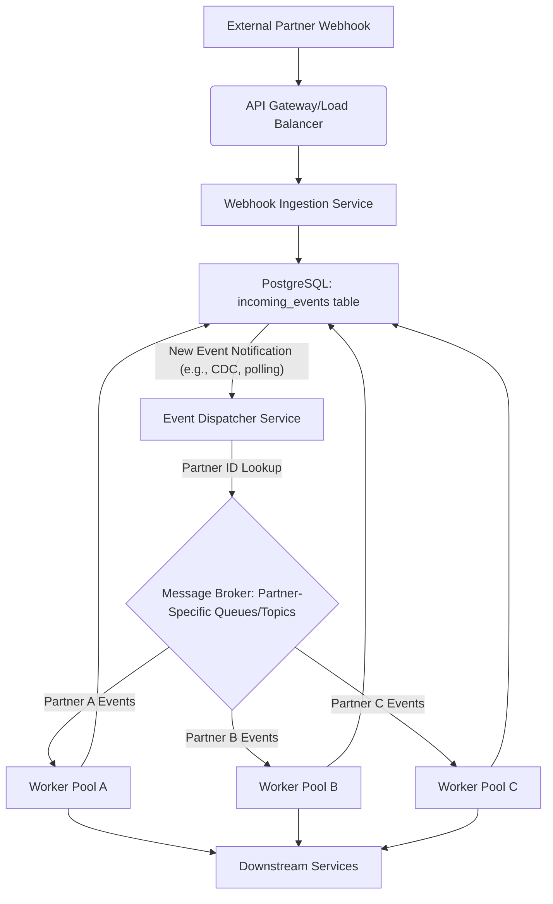

# 2026-09-20 — Distributed systems

*Sunday. Question and worked answer, both generated.*

---

## Scenario

Your team maintains a critical backend service that processes incoming webhook events from various external partners. These webhooks often notify your system about significant state changes (e.g., "order paid," "shipment delivered," "user subscribed"). To ensure data consistency and enable downstream processing, these events are first recorded in an `incoming_events` table in PostgreSQL and then asynchronously processed by a fleet of worker services.

Currently, the system uses a single, global event processing queue. Due to increasing event volume (millions of events per day) and the introduction of new partners with bursty traffic patterns, your single queue is experiencing backlogs. When a worker fails to process an event (e.g., due to a transient external API error), it's immediately retried, sometimes exacerbating congestion. More critically, a single slow-processing or failing partner can starve other partners' events, leading to cascading delays across the entire system. You need to ensure fair processing and isolate failures.

## Requirements

The core problem is to design a system that can process these events concurrently, ensure fair resource allocation across different partners, and gracefully handle transient failures without impacting other partners. The solution must scale to tens of millions of events daily from hundreds of partners, each with varying traffic profiles and processing requirements. Latency for critical events for high-priority partners should remain low, ideally under 500ms from receipt to initial processing attempt. You should also consider how to prevent a single faulty event from indefinitely blocking a worker or a queue.

## Deliverables

1.  Outline a high-level architectural change to the event processing system, focusing on how events are queued and processed to achieve partner isolation and fault tolerance.
2.  Describe how the system would handle a transient processing failure for a specific event from one partner, ensuring it's retried without affecting other partners' events.
3.  Explain how new partners can be onboarded to this system without manual intervention in the queuing or processing logic.
4.  Specify the key data structures or mechanisms (e.g., message brokers, database patterns) you would use to implement this, focusing on how they achieve the stated requirements.

## Going further

How would you ensure that events for a *single partner* are processed in order of their arrival, even with distributed workers and retries, without introducing a global ordering bottleneck?

---

## Worked answer

### 1. High-level architectural change

The core problem stems from a single, global queue creating contention and a lack of isolation. To address this, we will move from a single queue to a sharded, multi-queue system, where each partner (or a group of partners) is assigned its own logical queue. This provides strong isolation.

The high-level architecture will involve:

1.  **Event Ingestion Layer:** This remains largely the same, receiving webhooks and persisting them to the `incoming_events` PostgreSQL table.
2.  **Event Dispatcher:** A new component responsible for reading new events from `incoming_events` and dispatching them to the appropriate partner-specific queue. This component will be horizontally scalable.
3.  **Partner-Specific Queues:** Instead of a single queue, we will use a message broker (e.g., Kafka, RabbitMQ, AWS SQS) to create dedicated queues or topics for each partner. For Kafka, this would typically be a topic per partner, or a topic with partner-specific partitions. For SQS, it would be a dedicated queue per partner.
4.  **Worker Pools:** We will have multiple worker pools. Each pool can be configured to consume from one or more partner-specific queues. This allows us to dedicate resources (workers) to high-priority partners or partners with high traffic. Workers will process events, update the `incoming_events` table status, and potentially interact with downstream services.

Here's a simplified flow:



**Trade-offs:**

*   **Increased operational complexity:** Managing hundreds of queues/topics is more complex than one.
*   **Resource overhead:** Each queue/topic might have some minimal resource overhead, even if empty.
*   **Dynamic scaling of queues:** While workers can scale dynamically, the number of queues scales with partners, which needs to be managed.

### 2. Handling transient processing failures

With partner-specific queues, transient failures are isolated to that partner's event stream. We will leverage the message broker's retry mechanisms and a dead-letter queue (DLQ) pattern.

Let's assume we are using **AWS SQS** for our message broker, as it simplifies queue management for a large number of queues and provides built-in DLQ functionality.

1.  **Initial Processing:** A worker from the appropriate pool consumes an event from `partner_A_queue`.
2.  **Transient Failure:** If the worker fails to process the event (e.g., network timeout, external service error), it does *not* delete the message from the queue. Instead, it might throw an exception or explicitly return a failure status.
3.  **Visibility Timeout & Retries:** SQS has a "Visibility Timeout." When a message is consumed, it becomes invisible to other consumers for this duration. If the consumer fails to delete the message before the timeout, it becomes visible again and can be picked up by another worker. We configure a `ReceiveMessageWaitTimeSeconds` to allow long polling and reduce costs.
    *   We also configure a `RedrivePolicy` on `partner_A_queue` to send messages to a `partner_A_dlq` after a certain number of receive attempts (e.g., 5 attempts).
4.  **Exponential Backoff:** Workers can implement exponential backoff on their *own* retries within the application logic before letting the message become visible again. However, relying on SQS's visibility timeout and redrive policy is generally more robust for distributed retries.
5.  **Dead-Letter Queue (DLQ):** If an event fails processing after the maximum number of retries (e.g., 5 attempts), SQS automatically moves it to `partner_A_dlq`. This prevents a "poison pill" message from indefinitely blocking `partner_A_queue`.
    *   The DLQ can be monitored, and alerts can be triggered when messages land there.
    *   A separate process or manual intervention can inspect DLQ messages, fix underlying issues (if any), and potentially re-inject them into the main queue.

**Example SQS Queue Configuration (Terraform):**

```terraform
resource "aws_sqs_queue" "partner_a_queue" {
  name                       = "partner-a-events-queue"
  delay_seconds              = 0
  max_message_size           = 262144 # 256 KB
  message_retention_seconds  = 345600 # 4 days
  receive_message_wait_time_seconds = 20 # Long polling
  visibility_timeout_seconds = 60 # Message invisible for 60s during processing

  redrive_policy = jsonencode({
    deadLetterTargetArn = aws_sqs_queue.partner_a_dlq.arn
    maxReceiveCount     = 5 # After 5 failed attempts, move to DLQ
  })

  tags = {
    Partner = "PartnerA"
    Purpose = "EventProcessing"
  }
}

resource "aws_sqs_queue" "partner_a_dlq" {
  name                       = "partner-a-events-dlq"
  message_retention_seconds  = 1209600 # 14 days
  tags = {
    Partner = "PartnerA"
    Purpose = "DeadLetterQueue"
  }
}
```

This setup ensures that:
*   Retries for Partner A's events only affect Partner A's queue.
*   A problematic event for Partner A eventually moves to Partner A's DLQ, preventing it from blocking the main queue.
*   Other partners' queues and workers remain unaffected.

**Trade-offs:**

*   **Increased SQS cost:** More queues mean more API calls and storage, though SQS is generally cost-effective.
*   **Monitoring complexity:** Need to monitor hundreds of queues and DLQs.
*   **DLQ management:** Requires a strategy for handling messages in DLQs.

### 3. Onboarding new partners without manual intervention

Automating partner onboarding is crucial for scalability. We can achieve this by integrating partner management with our infrastructure-as-code (IaC) and event dispatching logic.

1.  **Partner Registry:** Maintain a central "Partner Registry" (e.g., a dedicated database table or a configuration service like AWS AppConfig/Consul). This registry stores metadata for each partner, including their `partner_id`, priority, and any specific processing configurations.

    ```sql
    CREATE TABLE partners (
        partner_id UUID PRIMARY KEY DEFAULT gen_random_uuid(),
        name VARCHAR(255) NOT NULL UNIQUE,
        status VARCHAR(50) NOT NULL DEFAULT 'active', -- active, inactive, suspended
        priority INT NOT NULL DEFAULT 5, -- 1 (highest) to 10 (lowest)
        created_at TIMESTAMPTZ DEFAULT NOW(),
        updated_at TIMESTAMPTZ DEFAULT NOW()
    );
    ```

2.  **Automated Queue Provisioning:**
    *   When a new partner is added to the `partners` registry, a CI/CD pipeline or an internal provisioning service is triggered.
    *   This service uses IaC (e.g., Terraform) to automatically provision the necessary SQS queue and its associated DLQ for the new partner. The queue name can be derived directly from the `partner_id` (e.g., `partner-{partner_id}-events-queue`).
    *   The Terraform configuration for queues can use a `for_each` loop over a list of active partners fetched from the registry or a configuration file.

    ```terraform
    # Example: Fetch active partners from a data source or configuration
    # In a real system, this might be dynamically generated or fetched from a service
    variable "active_partners" {
      description = "List of active partner IDs"
      type        = list(string)
      default     = ["partner-a", "partner-b"] # Example, would be dynamic
    }

    resource "aws_sqs_queue" "partner_queues" {
      for_each = toset(var.active_partners)

      name                       = "${each.value}-events-queue"
      delay_seconds              = 0
      max_message_size           = 262144
      message_retention_seconds  = 345600
      receive_message_wait_time_seconds = 20
      visibility_timeout_seconds = 60

      redrive_policy = jsonencode({
        deadLetterTargetArn = aws_sqs_queue.partner_dlqs[each.value].arn
        maxReceiveCount     = 5
      })

      tags = {
        Partner = each.value
        Purpose = "EventProcessing"
      }
    }

    resource "aws_sqs_queue" "partner_dlqs" {
      for_each = toset(var.active_partners)

      name                       = "${each.value}-events-dlq"
      message_retention_seconds  = 1209600
      tags = {
        Partner = each.value
        Purpose = "DeadLetterQueue"
      }
    }
    ```

3.  **Event Dispatcher Logic:** The Event Dispatcher service, upon receiving a new event, queries the `incoming_events` table (which should include `partner_id`). It then dynamically constructs the target queue name based on the `partner_id` and sends the message to the appropriate SQS queue. It doesn't need to know *a priori* which queues exist, only the naming convention.

    ```typescript
    // Example Node.js/TypeScript pseudo-code for Event Dispatcher
    import { SQSClient, SendMessageCommand } from "@aws-sdk/client-sqs";

    const sqsClient = new SQSClient({ region: "us-east-1" });
    const SQS_QUEUE_URL_PREFIX = "https://sqs.us-east-1.amazonaws.com/123456789012/"; // Your AWS account ID

    async function dispatchEvent(event: { id: string, partnerId: string, payload: any }) {
        const queueName = `${event.partnerId}-events-queue`;
        const queueUrl = `${SQS_QUEUE_URL_PREFIX}${queueName}`;

        try {
            const command = new SendMessageCommand({
                QueueUrl: queueUrl,
                MessageBody: JSON.stringify(event.payload),
                MessageGroupId: event.partnerId, // For FIFO queues, if needed
                MessageDeduplicationId: event.id // For FIFO queues, if needed
            });
            await sqsClient.send(command);
            console.log(`Event ${event.id} dispatched to ${queueName}`);
            // Update event status in PostgreSQL to 'dispatched'
        } catch (error) {
            console.error(`Failed to dispatch event ${event.id} to ${queueName}:`, error);
            // Handle dispatch failure (e.g., log, alert, retry)
        }
    }
    ```

4.  **Dynamic Worker Pool Configuration:** Worker pools can be configured to consume from a set of queues. For example, a "high-priority" worker pool might consume from `partner-X-events-queue` and `partner-Y-events-queue`, while a "general" worker pool consumes from all other active partner queues. This can be managed via configuration that workers load dynamically or on startup. New partners can be added to the "general" pool by default.

This approach minimizes manual steps for new partner onboarding, requiring only an entry in the `partners` registry to trigger the full provisioning and integration.

**Trade-offs:**

*   **Dependency on IaC automation:** Robust CI/CD and error handling for queue provisioning are critical.
*   **Dynamic configuration management:** Workers need a way to discover or be configured with the queues they should consume.
*   **Potential for resource sprawl:** If partners are frequently onboarded and offboarded, managing dormant queues becomes a concern.

### 4. Key data structures and mechanisms

1.  **PostgreSQL `incoming_events` table:**
    *   **Purpose:** The single source of truth for all incoming events, ensuring durability and atomicity upon receipt. It also serves as a backlog for the Event Dispatcher.
    *   **Schema:**
        ```sql
        CREATE TYPE event_status AS ENUM ('received', 'dispatched', 'processing', 'completed', 'failed', 'retrying');

        CREATE TABLE incoming_events (
            id UUID PRIMARY KEY DEFAULT gen_random_uuid(),
            partner_id UUID NOT NULL REFERENCES partners(partner_id), -- Foreign key to partners table
            event_type VARCHAR(100) NOT NULL,
            payload JSONB NOT NULL,
            status event_status NOT NULL DEFAULT 'received',
            received_at TIMESTAMPTZ DEFAULT NOW(),
            dispatched_at TIMESTAMPTZ,
            processed_at TIMESTAMPTZ,
            last_attempt_at TIMESTAMPTZ,
            attempt_count INT DEFAULT 0,
            error_message TEXT,
            -- Index for efficient lookup by dispatcher
            INDEX idx_incoming_events_status_received (status) WHERE status = 'received',
            -- Index for partner-specific queries (e.g., auditing)
            INDEX idx_incoming_events_partner_id (partner_id)
        );
        ```
    *   **Mechanism:**
        *   Webhook ingestion service inserts events with `status = 'received'`.
        *   Event Dispatcher polls this table for `status = 'received'` events (or uses CDC like Debezium/logical replication for lower latency) and updates `status = 'dispatched'` after sending to SQS.
        *   Workers update `status` to `processing`, `completed`, or `failed`/`retrying` (if application-level retries are implemented) after processing.

2.  **AWS SQS (Standard or FIFO queues):**
    *   **Purpose:** Provides reliable, scalable, and isolated message queuing for each partner.
    *   **Mechanism:**
        *   **Standard Queues:** Offer high throughput and at-least-once delivery. Messages are generally delivered in the order they are sent, but occasionally another copy of a message might be delivered out of order. This is acceptable for most event processing where eventual consistency is fine, and idempotency is handled by workers.
        *   **FIFO Queues:** Guarantee exactly-once processing and strict message ordering. This is critical for the "going further" section.
        *   **Visibility Timeout:** Prevents multiple workers from processing the same message concurrently during a transient failure.
        *   **Redrive Policy & DLQs:** Handles persistent failures by moving messages to a separate queue, preventing queue blockage.
        *   **Long Polling:** Reduces costs and latency by allowing workers to wait for messages instead of constantly polling.

3.  **Worker Services (Stateless):**
    *   **Purpose:** Consume messages from SQS, process the events, and interact with downstream systems.
    *   **Mechanism:**
        *   Workers are designed to be stateless and horizontally scalable.
        *   They poll their assigned SQS queues, deserialize the event payload, perform business logic, and then delete the message from SQS upon successful processing.
        *   Idempotency is crucial: Workers must be able to process the same event multiple times without adverse side effects, as SQS Standard queues offer at-least-once delivery. This can be achieved by using the `event.id` as a transaction ID or by checking the state of the target system before applying changes.

4.  **Partner Registry (PostgreSQL `partners` table):**
    *   **Purpose:** Centralized management of partner metadata, enabling automated provisioning and dynamic configuration.
    *   **Mechanism:** Referenced by the `incoming_events` table for data integrity and by the automated provisioning system.

**Why these choices work:**

*   **Partner Isolation:** Dedicated SQS queues mean one partner's traffic or processing issues do not affect others.
*   **Scalability:** SQS scales automatically. Worker pools can be scaled independently for each partner or group of partners based on demand. PostgreSQL can be scaled vertically or read replicas can be used for the dispatcher's polling.
*   **Fault Tolerance:** SQS's visibility timeout and DLQs handle transient and persistent failures gracefully. Idempotent workers prevent data corruption from duplicate processing.
*   **Fair Resource Allocation:** By assigning different worker pools to different partner queues, we can dedicate more resources (CPU, memory) to high-priority or high-volume partners.
*   **Low Latency for Critical Events:** High-priority partners can have dedicated, highly-resourced worker pools, ensuring their events are picked up and processed quickly. The Event Dispatcher using CDC (Change Data Capture) instead of polling for `received` events would further reduce latency.

**What breaks first at ten times the scale (hundreds of millions of events daily, thousands of partners):**

1.  **PostgreSQL `incoming_events` write throughput:** While inserts are fast, if the Event Dispatcher cannot keep up with the rate of new events, the `incoming_events` table could become a bottleneck for writes. This would manifest as increased latency for the initial webhook ingestion.
    *   **Mitigation:** Sharding the `incoming_events` table by `partner_id` or using a more write-optimized database for the initial ingestion (e.g., Apache Cassandra, DynamoDB) before moving to PostgreSQL for longer-term storage/auditing.
2.  **Event Dispatcher throughput:** Polling `incoming_events` for new events might become inefficient.
    *   **Mitigation:** Switching from polling to PostgreSQL's logical replication (e.g., using Debezium) to stream new `incoming_events` inserts directly to the dispatcher or a Kafka topic, significantly reducing latency and load on the database.
3.  **SQS Queue Management:** Managing thousands of individual SQS queues and their associated DLQs, even with IaC, can become unwieldy for monitoring, alerting, and cost analysis.
    *   **Mitigation:** Consider using a single Kafka topic with `partner_id` as the message key. Kafka partitions would then provide the isolation. This reduces the number of "queues" to manage to just one topic, but shifts complexity to Kafka cluster management and consumer group configuration.
4.  **Worker Pool Management:** Configuring and scaling thousands of distinct worker pools for individual partners would be complex.
    *   **Mitigation:** Group partners into tiers (e.g., "premium," "standard," "free") and assign a shared worker pool to each tier, consuming from all queues belonging to that tier. This reduces the number of worker pools to manage.

### Going further: Ensuring in-order processing for a single partner

Ensuring strict in-order processing for a *single partner* across distributed workers and retries is a classic challenge. Standard SQS queues do not guarantee strict ordering.

Here's how to achieve it using **AWS SQS FIFO queues**:

1.  **Use SQS FIFO Queues:** Instead of standard SQS queues, provision SQS FIFO queues for partners that require strict ordering.
    *   **Configuration:** FIFO queues require a `MessageGroupId` and support `MessageDeduplicationId`.
    *   **`MessageGroupId`:** All messages belonging to the same `MessageGroupId` are processed in a strict order, one by one. SQS guarantees that only one consumer can process messages for a given `MessageGroupId` at any time.
    *   **`MessageDeduplicationId`:** Ensures exactly-once delivery within a 5-minute deduplication interval.

2.  **Event Dispatcher with `MessageGroupId`:** When the Event Dispatcher sends an event to a partner's FIFO queue, it must set the `MessageGroupId`. For strict ordering *per partner*, the `partner_id` itself is the most natural `MessageGroupId`.

    ```typescript
    // Example Node.js/TypeScript pseudo-code for Event Dispatcher using FIFO
    import { SQSClient, SendMessageCommand } from "@aws-sdk/client-sqs";

    const sqsClient = new SQSClient({ region: "us-east-1" });
    const SQS_QUEUE_URL_PREFIX = "https://sqs.us-east-1.amazonaws.com/123456789012/";

    async function dispatchEventToFifo(event: { id: string, partnerId: string, payload: any }) {
        const queueName = `${event.partnerId}-events-fifo.sqs`; // FIFO queue names must end with .fifo
        const queueUrl = `${SQS_QUEUE_URL_PREFIX}${queueName}`;

        try {
            const command = new SendMessageCommand({
                QueueUrl: queueUrl,
                MessageBody: JSON.stringify(event.payload),
                MessageGroupId: event.partnerId, // All events for this partner go into the same group
                MessageDeduplicationId: event.id // Use event ID for deduplication
            });
            await sqsClient.send(command);
            console.log(`Event ${event.id} dispatched to FIFO queue ${queueName}`);
        } catch (error) {
            console.error(`Failed to dispatch event ${event.id} to FIFO queue ${queueName}:`, error);
        }
    }
    ```

3.  **Worker Processing with FIFO Guarantees:**
    *   When a worker consumes a message from a FIFO queue, SQS ensures that no other worker can consume another message with the same `MessageGroupId` until the first message is deleted or its visibility timeout expires.
    *   If a worker fails to process an event and the message becomes visible again, SQS ensures it will be delivered to a worker *before* any subsequent messages for that `MessageGroupId`. This maintains order during retries.
    *   The `RedrivePolicy` for DLQs works the same way, preserving order for the failed messages within their `MessageGroupId` context.

**Terraform for FIFO Queue:**

```terraform
resource "aws_sqs_queue" "partner_a_fifo_queue" {
  name                       = "partner-a-events-fifo.sqs" # Must end with .fifo
  fifo_queue                 = true
  content_based_deduplication = false # We'll provide MessageDeduplicationId manually
  delay_seconds              = 0
  max_message_size           = 262144
  message_retention_seconds  = 345600
  receive_message_wait_time_seconds = 20
  visibility_timeout_seconds = 60

  redrive_policy = jsonencode({
    deadLetterTargetArn = aws_sqs_queue.partner_a_fifo_dlq.arn
    maxReceiveCount     = 5
  })

  tags = {
    Partner = "PartnerA"
    Purpose = "EventProcessingFIFO"
  }
}

resource "aws_sqs_queue" "partner_a_fifo_dlq" {
  name                       = "partner-a-events-fifo-dlq.sqs"
  fifo_queue                 = true
  message_retention_seconds  = 1209600
  tags = {
    Partner = "PartnerA"
    Purpose = "DeadLetterQueueFIFO"
  }
}
```

**Why this works and trade-offs:**

*   **Strict Ordering:** SQS FIFO queues guarantee that messages with the same `MessageGroupId` are processed in the exact order they are sent.
*   **Exactly-Once Processing:** `MessageDeduplicationId` ensures that even if the dispatcher sends the same event twice, it's only delivered once within the deduplication window.
*   **No Global Bottleneck:** The ordering guarantee is *per `MessageGroupId`*, which in this case is `partner_id`. This means Partner A's events are ordered, but this doesn't block Partner B's events.
*   **Reduced Throughput:** FIFO queues have lower throughput limits (up to 3,000 messages per second with batching, or 300 without) compared to standard queues. For high-volume partners requiring ordering, this could become a bottleneck.
*   **Increased Cost:** FIFO queues can be slightly more expensive than standard queues.
*   **Complexity:** Requires careful management of `MessageGroupId` and `MessageDeduplicationId`.

For partners that do not require strict ordering, standard SQS queues are preferred due to their higher throughput and lower cost. The system can support a mix of both FIFO and Standard queues, provisioned based on partner requirements.
