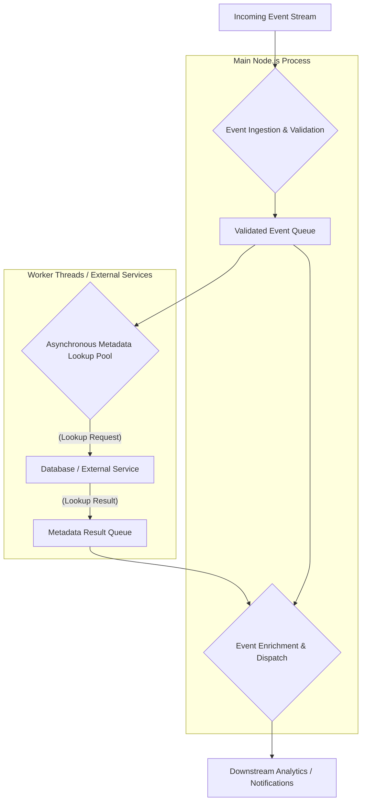

# 2026-10-06 — TypeScript and Node.js

*Tuesday. Question and worked answer, both generated.*

---

## Scenario

Your team maintains a critical Node.js microservice that processes real-time user activity events for a large social media platform. These events (e.g., `post_created`, `comment_added`, `user_followed`) arrive as a continuous stream from various client applications and other internal services. The service's primary responsibility is to validate these events, enrich them with additional user and content metadata, and then dispatch them to downstream analytics and notification systems.

Recently, due to a surge in platform usage and the introduction of several new event types, the service has begun experiencing intermittent latency spikes and increased memory consumption, particularly during peak hours. Analysis shows that the CPU is often saturated, and the event processing backlog is growing. The current event processing pipeline looks something like this: raw event -> validation -> metadata lookup (blocking I/O) -> enrichment -> dispatch. Each step needs to happen in order.

## Requirements

The service needs to handle up to 10,000 events per second consistently, with an end-to-end processing latency of under 50ms for 99% of events. The current system relies heavily on synchronous, blocking operations for metadata enrichment (e.g., fetching user profile data from a database). You suspect this is a major bottleneck, as these lookups can take several milliseconds. You need to improve the throughput and reduce the latency without significantly increasing the operational cost (e.g., by simply scaling up instances indefinitely). The solution should prioritize efficient use of existing resources.

## Deliverables

1.  Outline a revised architecture or code structure for the event processing pipeline that addresses the latency and throughput issues, specifically targeting the metadata enrichment step.
2.  Identify and justify the key Node.js features or patterns you would leverage to implement this revised pipeline efficiently.
3.  Provide TypeScript interfaces or types for the `RawEvent`, `EnrichedEvent`, and any intermediate data structures your proposed solution would use.
4.  Explain how your proposed solution would handle potential backpressure or spikes in incoming event volume.

## Going further

Consider a scenario where the metadata enrichment step involves calling multiple independent external services (e.g., user service, content service, moderation service). How would your solution adapt to minimize the cumulative latency from these multiple lookups, while still ensuring all necessary data is available for enrichment?

---

## Worked answer

### 1. Revised Architecture for Event Processing Pipeline

The core issue is the blocking I/O during metadata enrichment, which saturates the CPU and creates backpressure. Node.js is single-threaded for JavaScript execution, meaning a blocking operation halts all other JavaScript execution on that thread. To address this, we need to move blocking I/O operations out of the main event loop and leverage Node.js's asynchronous nature more effectively.

The revised architecture will introduce an asynchronous, non-blocking approach for metadata lookup and leverage concurrent processing where possible.

**Current Pipeline (Conceptual):**

```
Raw Event (Sync) -> Validate (Sync) -> Metadata Lookup (Blocking I/O) -> Enrich (Sync) -> Dispatch (Async)
```

**Revised Pipeline (Conceptual):**

```
Incoming Event Stream
        |
        V
[Event Ingestion & Validation] (Main Thread)
        | (Validated Event)
        V
[Asynchronous Metadata Lookup Pool] (Worker Threads / External Service)
        | (Metadata)
        V
[Event Enrichment & Dispatch] (Main Thread / Dedicated Process)
```

**Detailed Breakdown:**

1.  **Event Ingestion & Validation (Main Thread):**
    *   Receive raw events.
    *   Perform quick, CPU-bound validation (e.g., schema validation, basic field checks). This should remain on the main thread as it's typically fast.
    *   Enqueue validated events into an internal, in-memory queue (e.g., a `Map` or `Queue` data structure) for subsequent processing. Each event should be assigned a unique ID for tracking.

2.  **Asynchronous Metadata Lookup Pool (Worker Threads / External Service):**
    *   Instead of blocking the main thread, metadata lookups will be offloaded.
    *   **Option A: Node.js Worker Threads:** For CPU-bound tasks or I/O-bound tasks that can be parallelized within the same process (e.g., multiple concurrent database queries), worker threads can be used. The main thread sends the event ID and necessary lookup keys to a worker thread. The worker thread performs the blocking I/O (e.g., database query) and sends the result back to the main thread.
    *   **Option B: External Metadata Service/Cache:** For highly concurrent and potentially long-running I/O operations, it's often better to offload them to a dedicated, highly scalable external service (e.g., a microservice specifically for user profiles, content data, backed by a fast cache like Redis). The Node.js service would make an asynchronous HTTP/gRPC call to this service. This is generally preferred for critical, shared data.
    *   **Key Principle:** The main Node.js thread *initiates* the lookup and then immediately becomes free to process other incoming events. It does not wait for the lookup to complete.

3.  **Event Enrichment & Dispatch (Main Thread / Dedicated Process):**
    *   Once metadata lookups complete (either from a worker thread or an external service), the results are correlated with the original validated event (using the unique event ID).
    *   The event is then enriched with the retrieved metadata.
    *   Finally, the enriched event is dispatched to downstream systems (e.g., Kafka, SQS, another HTTP endpoint). This dispatch itself should be an asynchronous, non-blocking operation.
    *   This step can also be handled by a separate process or a dedicated pool of workers if enrichment logic becomes CPU-intensive, but for typical data merging, the main thread can handle it efficiently once data is available.

**Visualizing the Flow:**



### 2. Key Node.js Features and Patterns

To implement the revised pipeline efficiently, we would leverage the following Node.js features and patterns:

1.  **`async/await` and Promises:**
    *   **Justification:** These are fundamental for writing clean, readable asynchronous code in Node.js. They allow us to initiate I/O operations (like database queries or HTTP calls to external services) without blocking the main thread. The `await` keyword pauses the *execution of the current async function* but *not the entire Node.js process*, allowing the event loop to pick up other tasks.
    *   **Example:** Making an API call for metadata:
        ```typescript
        async function fetchMetadata(userId: string): Promise<UserMetadata> {
            const response = await fetch(`https://metadata.service/users/${userId}`);
            if (!response.ok) {
                throw new Error(`Failed to fetch metadata: ${response.statusText}`);
            }
            return response.json();
        }
        ```

2.  **Worker Threads (`worker_threads` module):**
    *   **Justification:** For CPU-bound tasks or I/O-bound tasks that involve blocking operations *within the Node.js process* (e.g., complex data transformations, heavy computations, or direct database drivers that might block the event loop if not properly awaited), worker threads provide a way to offload this work to separate threads. This prevents the main event loop from being blocked, ensuring the service remains responsive. Communication between the main thread and worker threads happens via message passing, which is non-blocking.
    *   **Example:** Offloading a heavy database query:
        ```typescript
        // main.ts
        import { Worker } from 'worker_threads';

        function processEventWithWorker(eventId: string, userId: string): Promise<EnrichedEvent> {
            return new Promise((resolve, reject) => {
                const worker = new Worker('./metadataWorker.js', {
                    workerData: { eventId, userId }
                });

                worker.on('message', (message) => {
                    if (message.type === 'metadata_result') {
                        resolve(message.enrichedEvent);
                    } else if (message.type === 'error') {
                        reject(new Error(message.error));
                    }
                });
                worker.on('error', reject);
                worker.on('exit', (code) => {
                    if (code !== 0) reject(new Error(`Worker stopped with exit code ${code}`));
                });
            });
        }

        // metadataWorker.js
        import { parentPort, workerData } from 'worker_threads';
        // Assume some blocking DB client
        import { getDbClient } from './dbClient';

        async function fetchAndEnrich() {
            const { eventId, userId } = workerData;
            try {
                const dbClient = getDbClient(); // Potentially blocking client
                const userMetadata = await dbClient.query(`SELECT * FROM users WHERE id = '${userId}'`);
                // Simulate enrichment
                const enrichedEvent = { eventId, userId, metadata: userMetadata[0], timestamp: Date.now() };
                parentPort?.postMessage({ type: 'metadata_result', enrichedEvent });
            } catch (error: any) {
                parentPort?.postMessage({ type: 'error', error: error.message });
            }
        }
        fetchAndEnrich();
        ```
    *   **Trade-off:** Worker threads introduce overhead for communication and context switching. They are best for tasks that are genuinely CPU-intensive or involve blocking native modules. For purely I/O-bound tasks that are inherently asynchronous (like `fetch` or `axios` HTTP calls, or most modern database drivers), `async/await` on the main thread is usually sufficient and simpler.

3.  **Non-Blocking I/O (Event Loop):**
    *   **Justification:** This is the fundamental strength of Node.js. All standard I/O operations (network requests, file system access, database queries using modern drivers) are designed to be non-blocking. By ensuring our metadata lookups and dispatch operations use non-blocking APIs (e.g., `axios` for HTTP, `pg` for PostgreSQL, `ioredis` for Redis), we maximize the throughput of the single main thread.
    *   **Example:** Using a non-blocking Redis client for caching metadata:
        ```typescript
        import Redis from 'ioredis';
        const redis = new Redis();

        async function getCachedMetadata(userId: string): Promise<UserMetadata | null> {
            const cached = await redis.get(`user:${userId}:metadata`);
            return cached ? JSON.parse(cached) : null;
        }

        async function setCachedMetadata(userId: string, metadata: UserMetadata) {
            await redis.set(`user:${userId}:metadata`, JSON.stringify(metadata), 'EX', 3600); // Cache for 1 hour
        }
        ```

4.  **Queues (In-memory or External):**
    *   **Justification:** Queues act as buffers between different stages of the pipeline, decoupling producers from consumers.
        *   **In-memory Queues (e.g., `Map<string, RawEvent>` for pending events, `Map<string, Promise<Metadata>>` for pending lookups):** Useful for managing events awaiting metadata or results from worker threads. They help manage the flow within the Node.js process.
        *   **External Queues (e.g., Kafka, RabbitMQ, SQS):** Essential for handling backpressure and ensuring durability between microservices. If our service is a consumer, it pulls events at its own pace. If it's a producer, it pushes enriched events to a downstream queue.
    *   **Example (In-memory pending events):**
        ```typescript
        const pendingEvents = new Map<string, RawEvent>(); // Stores events awaiting metadata
        const pendingMetadataLookups = new Map<string, Promise<UserMetadata>>(); // Stores promises for metadata
        ```

5.  **Concurrency with `Promise.all` / `Promise.allSettled`:**
    *   **Justification:** When multiple independent asynchronous operations are needed for a single event (e.g., fetching user data and content data), `Promise.all` allows these operations to run concurrently. This significantly reduces the total waiting time compared to fetching them sequentially.
    *   **Example:** (Covered in "Going Further" section)

### 3. TypeScript Interfaces

```typescript
// Unique identifier for an event
type EventId = string;

/**
 * Represents an event as it's initially received by the service.
 */
interface RawEvent {
    id: EventId;
    type: 'post_created' | 'comment_added' | 'user_followed' | 'ad_clicked';
    timestamp: number; // Unix timestamp in milliseconds
    userId: string;
    payload: Record<string, any>; // Arbitrary event-specific data
    sourceIp?: string;
    userAgent?: string;
    // ... other common raw event fields
}

/**
 * Represents metadata fetched for a user.
 */
interface UserMetadata {
    userId: string;
    username: string;
    email: string;
    registrationDate: number; // Unix timestamp in milliseconds
    isPremiumUser: boolean;
    lastLoginIp: string;
    // ... other user-specific data
}

/**
 * Represents metadata fetched for a content item (e.g., post, comment).
 */
interface ContentMetadata {
    contentId: string;
    contentType: 'post' | 'comment';
    authorId: string;
    creationDate: number;
    tags: string[];
    status: 'active' | 'deleted' | 'moderated';
    // ... other content-specific data
}

/**
 * Represents an event after it has been validated and is awaiting metadata lookup.
 * This is an intermediate state.
 */
interface ValidatedEvent extends RawEvent {
    validationStatus: 'success';
    validationErrors?: never; // No errors for a validated event
    // Potentially add a field to track which metadata types are needed
    requiredMetadata: ('user' | 'content')[];
}

/**
 * Represents an event with all necessary metadata attached, ready for dispatch.
 */
interface EnrichedEvent extends ValidatedEvent {
    metadata: {
        user?: UserMetadata;
        content?: ContentMetadata;
        // ... potentially other metadata types
    };
    enrichmentTimestamp: number; // When enrichment was completed
}

/**
 * Represents an event that failed validation.
 */
interface InvalidEvent extends RawEvent {
    validationStatus: 'failed';
    validationErrors: string[];
}

/**
 * Represents an event that could not be enriched due to missing metadata or errors.
 * This might be a separate stream for error handling/retries.
 */
interface FailedEnrichmentEvent extends ValidatedEvent {
    enrichmentStatus: 'failed';
    enrichmentErrors: string[];
    metadata?: never; // No metadata if enrichment failed
}

// Example of an in-memory queue structure for events awaiting enrichment
interface EventProcessingQueue {
    [eventId: string]: {
        event: ValidatedEvent;
        metadataPromise: Promise<UserMetadata | ContentMetadata | (UserMetadata & ContentMetadata)>; // Or a map of promises
        // You might store a Promise.all result here if multiple lookups are needed
    };
}
```

### 4. Handling Backpressure and Spikes

Backpressure occurs when the rate of incoming events exceeds the rate at which the service can process them. Spikes are sudden, temporary increases in this rate. Our solution addresses these with a multi-layered approach:

1.  **External Queues (Upstream):**
    *   **Mechanism:** The most robust first line of defense. If events arrive via an external message queue (e.g., Kafka, SQS, RabbitMQ), the queue itself acts as a buffer. Our Node.js service can consume messages at its own pace. If processing slows down, the consumer offset will simply lag, and messages will accumulate in the queue without being dropped.
    *   **Benefit:** Decouples the event producer from the consumer, provides durability, and allows for horizontal scaling of consumers.
    *   **Drawback:** Introduces latency due to queuing.

2.  **Internal In-Memory Queues/Buffers:**
    *   **Mechanism:** Within the Node.js service, we can use in-memory data structures (like `Map` or `Array` acting as a queue) to temporarily hold `ValidatedEvent`s awaiting metadata or `MetadataResult`s awaiting enrichment.
    *   **Benefit:** Smooths out micro-spikes and allows the asynchronous processing stages to operate independently.
    *   **Drawback:** Limited by server memory. If a spike is prolonged and exceeds memory capacity, events could be dropped or the service could crash. This is a short-term buffer, not a long-term solution.

3.  **Concurrency Limits (Rate Limiting / Concurrency Pools):**
    *   **Mechanism:** We can implement explicit limits on the number of concurrent metadata lookups or worker thread tasks.
        *   **`p-limit` / `p-queue` (or custom Promise pool):** Libraries like `p-limit` can cap the number of concurrent promises (e.g., HTTP requests to metadata service). This prevents overwhelming downstream services or exhausting local resources (e.g., database connection pool).
        *   **Worker Thread Pool:** Maintain a fixed pool of worker threads rather than spawning a new one for every event. If all workers are busy, new tasks queue up.
    *   **Benefit:** Prevents resource exhaustion (CPU, memory, network sockets) and protects downstream services from being overloaded.
    *   **Drawback:** If the limit is hit, events will queue up internally, increasing latency. If the internal queue overflows, events might be dropped (if not handled by external queues).

4.  **Graceful Degradation / Prioritization:**
    *   **Mechanism:** During extreme load, the system could prioritize certain event types or actions. For example, `post_created` might be critical, while `ad_clicked` could tolerate higher latency or even temporary dropping. This involves conditional logic based on current load metrics.
    *   **Benefit:** Ensures critical functionality remains operational even under duress.
    *   **Drawback:** Requires careful design and business understanding of event priorities.

5.  **Monitoring and Alerting:**
    *   **Mechanism:** Crucial for detecting backpressure early. Monitor:
        *   Queue lengths (external and internal).
        *   Processing latency per stage.
        *   CPU, memory, and network utilization.
        *   Error rates.
    *   **Benefit:** Allows operations teams to react by scaling up instances, adjusting concurrency limits, or investigating bottlenecks.

6.  **Horizontal Scaling:**
    *   **Mechanism:** While the goal is efficient use of *existing* resources, scaling horizontally (adding more instances of the Node.js service) is the ultimate way to increase total throughput. The non-blocking architecture ensures that each instance can handle more events efficiently before needing to scale.
    *   **Benefit:** Provides linear scalability with increased demand.
    *   **Drawback:** Increases operational cost.

**How the proposed solution handles it:**

*   **Asynchronous Metadata Lookup:** By making metadata lookup non-blocking, the main thread is freed up to ingest more events. This inherently increases the capacity of a single instance before backpressure builds up.
*   **Worker Threads (if used):** Offloading CPU-intensive tasks to workers means the main thread isn't blocked, allowing it to continue processing the event stream. Worker threads can be pooled to limit concurrent heavy operations.
*   **External Metadata Service:** If metadata is fetched from an external service, that service can be independently scaled. Our Node.js service makes non-blocking requests, allowing it to handle many concurrent lookups.
*   **Internal Buffering:** The `pendingEvents` and `pendingMetadataLookups` maps act as short-term buffers.
*   **Concurrency Control:** We would implement a concurrency limit on the number of active metadata lookup requests (e.g., using `p-limit`) to prevent overwhelming the database or external metadata service. If this limit is reached, new lookup requests would queue up internally. If the internal queue grows too large, it signals that the downstream metadata service is the bottleneck.

### Going Further: Multiple Independent External Services

If the metadata enrichment step involves calling multiple independent external services (e.g., User Service, Content Service, Moderation Service), the key is to perform these lookups **concurrently** rather than sequentially.

**Revised Approach:**

1.  **Identify Required Metadata:** For each `ValidatedEvent`, determine all necessary metadata types (e.g., `UserMetadata`, `ContentMetadata`, `ModerationStatus`).
2.  **Initiate Concurrent Lookups:** For each required metadata type, trigger an asynchronous call to the respective external service *in parallel*.
3.  **Aggregate Results:** Use `Promise.all` or `Promise.allSettled` to wait for all these concurrent lookups to complete.
4.  **Enrich Event:** Once all results are available, combine them with the original event to form the `EnrichedEvent`.

**TypeScript Interfaces Adaptation:**

The `EnrichedEvent` interface would expand to include optional fields for each type of metadata.

```typescript
// New metadata types
interface ModerationMetadata {
    contentId: string;
    moderationStatus: 'approved' | 'rejected' | 'pending';
    moderatorId?: string;
    moderationDate?: number;
    // ...
}

/**
 * Represents an event with all necessary metadata attached, ready for dispatch.
 * Metadata fields are optional as not all events require all types,
 * or some lookups might fail.
 */
interface EnrichedEvent extends ValidatedEvent {
    metadata: {
        user?: UserMetadata;
        content?: ContentMetadata;
        moderation?: ModerationMetadata; // New metadata type
        // ... potentially other metadata types
    };
    enrichmentTimestamp: number;
}
```

**Implementation Sketch (using `Promise.all`):**

```typescript
import pLimit from 'p-limit'; // A library to limit concurrent promises

// Assume these functions make non-blocking HTTP/gRPC calls to external services
async function fetchUserMetadata(userId: string): Promise<UserMetadata | undefined> { /* ... */ }
async function fetchContentMetadata(contentId: string): Promise<ContentMetadata | undefined> { /* ... */ }
async function fetchModerationStatus(contentId: string): Promise<ModerationMetadata | undefined> { /* ... */ }

// Concurrency limit for external service calls
const metadataServiceConcurrencyLimit = pLimit(500); // Allow up to 500 concurrent requests

async function enrichEventWithMultipleMetadata(event: ValidatedEvent): Promise<EnrichedEvent | FailedEnrichmentEvent> {
    const lookupPromises: Promise<any>[] = [];
    const errors: string[] = [];
    const enrichedMetadata: EnrichedEvent['metadata'] = {};

    // Conditionally add lookup promises based on event type and required metadata
    if (event.requiredMetadata.includes('user')) {
        lookupPromises.push(
            metadataServiceConcurrencyLimit(() => fetchUserMetadata(event.userId))
                .then(data => { if (data) enrichedMetadata.user = data; })
                .catch(err => errors.push(`User metadata lookup failed: ${err.message}`))
        );
    }

    if (event.requiredMetadata.includes('content') && event.payload.contentId) {
        lookupPromises.push(
            metadataServiceConcurrencyLimit(() => fetchContentMetadata(event.payload.contentId))
                .then(data => { if (data) enrichedMetadata.content = data; })
                .catch(err => errors.push(`Content metadata lookup failed: ${err.message}`))
        );
        // Assuming moderation status is also content-related
        lookupPromises.push(
            metadataServiceConcurrencyLimit(() => fetchModerationStatus(event.payload.contentId))
                .then(data => { if (data) enrichedMetadata.moderation = data; })
                .catch(err => errors.push(`Moderation status lookup failed: ${err.message}`))
        );
    }

    // Wait for all lookups to complete concurrently
    await Promise.allSettled(lookupPromises); // Use allSettled to ensure all promises resolve/reject

    if (errors.length > 0) {
        // Log errors, potentially send to a dead-letter queue or retry mechanism
        console.error(`Failed to enrich event ${event.id}: ${errors.join(', ')}`);
        return {
            ...event,
            enrichmentStatus: 'failed',
            enrichmentErrors: errors,
            enrichmentTimestamp: Date.now()
        };
    }

    return {
        ...event,
        metadata: enrichedMetadata,
        enrichmentTimestamp: Date.now()
    };
}
```

**Why this works:**

*   **Minimized Cumulative Latency:** By initiating all independent lookups simultaneously using `Promise.allSettled`, the total latency for the enrichment step is dominated by the *slowest* individual lookup, not the sum of all lookups. If fetching user data takes 10ms and content data takes 15ms, the total wait time for both is approximately 15ms (plus network overhead and JavaScript execution time), not 25ms.
*   **Robustness with `Promise.allSettled`:** If one of the external services fails or times out, `Promise.allSettled` will still wait for all promises to conclude (either fulfilled or rejected). This allows us to collect all available metadata and log/handle errors for the failed lookups without halting the entire enrichment process for that event. We can then decide if partial enrichment is acceptable or if the event should be marked as `FailedEnrichmentEvent`.
*   **Concurrency Control (`p-limit`):** It's crucial to still limit the total number of *concurrent* requests being sent to *all* external services combined. Without `p-limit`, a sudden spike of 10,000 events per second, each requiring 3 external calls, could lead to 30,000 concurrent outbound HTTP requests, overwhelming the Node.js process (socket exhaustion, memory) or the downstream services. `p-limit` ensures we send requests at a manageable rate.

**Trade-offs:**

*   **Increased Complexity:** Managing multiple promises and their potential failures adds complexity compared to a single lookup.
*   **Error Handling:** Deciding how to handle partially failed enrichments (e.g., user metadata found, but content metadata failed) requires business logic. Is the event still useful? Should it be retried?
*   **Resource Consumption:** While concurrent, each external call still consumes network resources and potentially memory for buffering responses. `p-limit` helps manage this.

This concurrent, non-blocking approach is critical for meeting the 50ms latency requirement when multiple external dependencies are involved.
